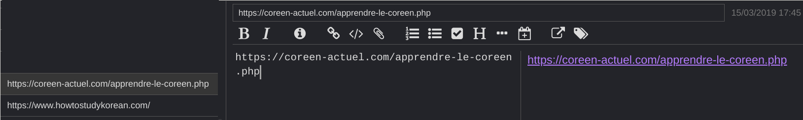
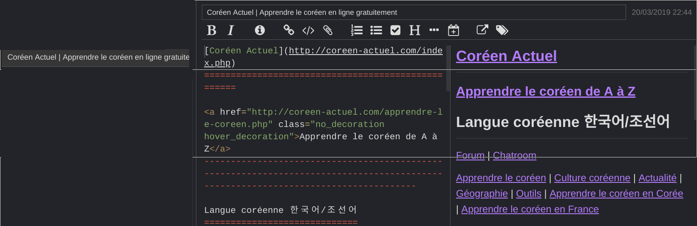

# Jong Toolkit - 종도구상자

this is a collection of scripts to ease the usage of our Joplin markdown editor

## Importer 

Import of notes into joplin from your cloud service

### prerequisite

* Python 3.7 or +
* [joplin terminal](https://joplinapp.org/terminal/) installed (at least or Joplin Desktop)
* joplin-api - to request joplin
* beautifulsoup - to get the html page
* pypandoc - to translate the html page to markdown

### installing

* create a virtualenv and activate it

```python 
python3 -m venv jong_toolkit
cd jong_toolkit
source bin/activate
```

* get the source 

```python
git clone https://github.com/foxmask/jong_toolkit
pip install -r requirements.txt
cd jong_toolkit
cp settings.sample settings.ini
```

set the value of JOPLIN_WEBCLIPPER_TOKEN 

### settings 

in `the jong_toolkit/settings.ini` file set the following properties
 
```ini 
[JOPLIN_CONFIG]
# path to the joplin terminal version
JOPLIN_BIN_PATH = /home/foxmask/.joplin-bin/bin/joplin
# path to the profile of the joplin client (terminal/desktop)
JOPLIN_PROFILE_PATH = /home/foxmask/.config/joplin-desktop
# path to the folder of the cloud storage service
JOPLIN_IMPORT_FOLDER = /home/foxmask/Dropbox/Applications/Joplin/letterbox/
# default folder where to import notes
JOPLIN_DEFAULT_FOLDER = Todo

```

## Importer

before running anything, check you started the joplin headless server, if not start it as follow

```
joplin --path /home/foxmask/.config/joplin-desktop server start
```

or start your joplin desktop version

then script to load JEX or MD files into joplin

### running

you can set a crontab or a "at" service to trigger the command at the given time you want

```python
python jong_toolkit/core.py --importer 
```


## Collector

the script will ease to grab note from note created with only URL as content

This situation occurs when you "share" page link from your phone to Joplin, as joplin does not provide a webclipper on mobile, this will complet this case ;)

### settings 
in the `settings.ini` file, set the `tag` that will be used for checking if notes need to be generated

```ini
# default tag to look at to grab the URL of the note to generate
JOPLIN_DEFAULT_TAG = grab
# tag assigned to the note once generated, if none, no tag assigned
JOPLIN_NEW_TAG = 
# URL port to reach JOPLIN
JOPLIN_WEBCLIPPER = 41184
# TOKEN to get data from joplin api
JOPLIN_WEBCLIPPER_TOKEN = <your token found in the webclippeer settings page>
# markdown
PYPANDOC_MARKDOWN = markdown_github
```

### running

you can set a crontab or a "at" service to trigger the command at the given time you want

```python
python jong_toolkit/core.py --collector
```

the note with the shared link



once the script has run




## Mailer

script to send a mail for each note that has been due

### settings 
in the `settings.ini` set those properties

```ini
[MAIL]
EMAIL_SERVER=localhost
EMAIL_FROM=root
EMAIL_TO=foxmask
```

### running

launch and forget ;) it will send a mail once it will found a new note where date is due


```python
python jong_toolkit/mailer.py
```
